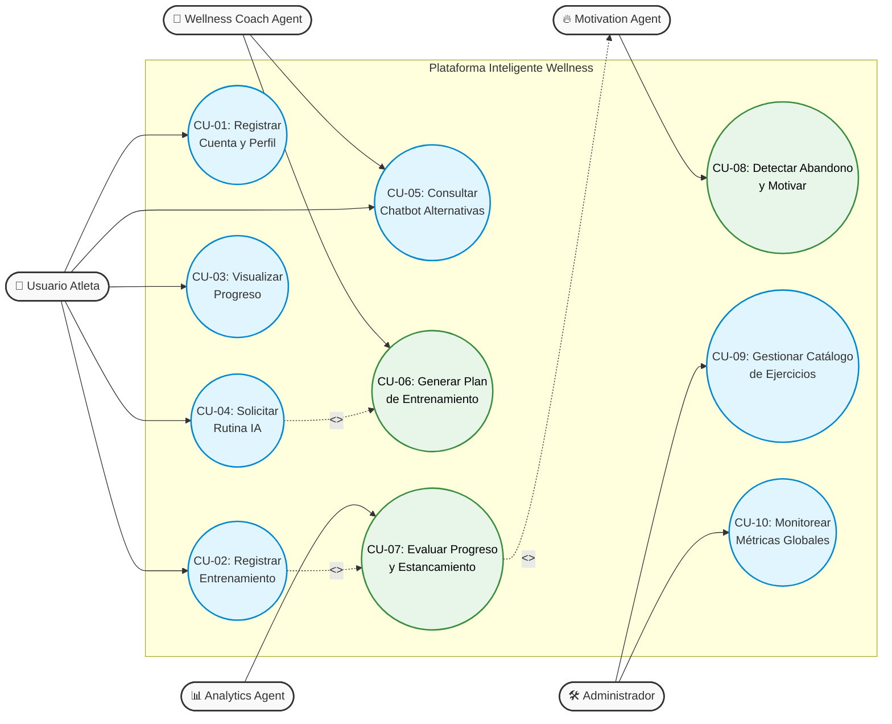

# 🏋️‍♂️ Plataforma Inteligente de Gestión Wellness basada en IA

Bienvenido al repositorio oficial del proyecto de maestría: **Sistema de Gestión de Rutinas Wellness con AI-Augmented Development**. 

Este proyecto implementa una arquitectura moderna orientada a microservicios, integrando un ecosistema de agentes de Inteligencia Artificial para automatizar la creación de rutinas, predecir el progreso del atleta y prevenir el abandono mediante motivación inteligente.

## 🚀 Arquitectura y Tecnologías (Tech Stack)
* **Paradigma:** Arquitectura orientada a servicios, Event-driven, Cloud-native.
* **Integración IA:** AI-first, MCP-ready architecture.
* **Nicho Wellness Seleccionado:** Fitness y Levantamiento de Pesas.


## 📦 Entregables del Sprint Técnico 1: Ingeniería de Requisitos y Calidad
En este sprint se ha definido formalmente el sistema y se ha establecido la arquitectura base.
1. [x] Selección del nicho y límites del sistema.
2. [x] Requisitos Funcionales y No Funcionales (ISO 25010).
3. [x] Historias de Usuario (Metodología Ágil).
4. [x] Diagramas UML de Casos de Uso.
5. [x] Diseño Preliminar del Wellness Coach Agent.

## 📋 Requisitos Funcionales (RF)
Estos requisitos definen qué debe hacer el sistema. Los hemos dividido por módulos lógicos para facilitar la futura creación de microservicios.

### Módulo 1: Gestión de Usuarios y Perfiles
* **RF-01:** El sistema debe permitir a los usuarios registrarse e iniciar sesión utilizando correo electrónico/contraseña o autenticación de terceros (ej. Google OAuth).
* **RF-02:** El sistema debe recopilar y almacenar los datos antropométricos iniciales del usuario (peso corporal, altura, edad, género).
* **RF-03:** El sistema debe permitir al usuario definir sus objetivos principales (ej. hipertrofia, ganancia de fuerza, pérdida de grasa, mantenimiento).

### Módulo 2: Gestión de Rutinas y Entrenamientos (Core Fitness)
* **RF-04:** El sistema debe permitir al usuario registrar los detalles de cada sesión de entrenamiento, incluyendo: tipo de ejercicio, series, repeticiones ejecutadas y peso levantado.
* **RF-05:** El sistema debe contar con una base de datos estandarizada de ejercicios de fuerza y musculación (clasificados por grupo muscular y equipamiento).
* **RF-06:** El sistema debe calcular métricas de sesión automáticamente, como el volumen de carga total (Series x Repeticiones x Peso).

### Módulo 3: Inteligencia Artificial (Wellness Coach Agent)
* **RF-07:** El agente de IA debe generar un plan de entrenamiento semanal estructurado basado en el objetivo del usuario, su nivel de experiencia y los días disponibles para entrenar.
* **RF-08:** El agente de IA debe analizar el historial de cargas del usuario y sugerir ajustes para garantizar la sobrecarga progresiva (ej. "Te sugiero aumentar 2kg en Sentadilla esta semana").
* **RF-09:** El sistema debe incluir una interfaz de "Chat Asistente Wellness" donde el usuario pueda consultar dudas sobre ejecución de ejercicios o pedir adaptaciones en tiempo real (ej. "La máquina de poleas está ocupada, ¿qué otro ejercicio puedo hacer?").
* **RF-10:** El agente debe detectar patrones de estancamiento o disminución del rendimiento y enviar alertas proactivas o mensajes motivacionales para prevenir el abandono.

### Módulo 4: Analítica y Progreso
* **RF-11:** El sistema debe mostrar un panel interactivo (Dashboard) con la proyección de progreso físico y de cargas en el tiempo estimado.

---

## 🛡️ Requisitos No Funcionales (RNF) - Evaluación ISO 25010
Estos requisitos definen cómo el sistema debe comportarse, alineados directamente con el estándar de calidad ISO 25010.

* **RNF-01 - Adecuación Funcional:** Las sugerencias de rutinas generadas por la IA deben basarse en principios comprobados de hipertrofia y fuerza, asegurando que los ejercicios recomendados sean biomecánicamente coherentes.
* **RNF-02 - Eficiencia de Desempeño:**
  * El tiempo de respuesta de la API Gateway para consultas CRUD básicas no debe superar los 500 ms.
  * El tiempo de respuesta del Agente IA para generar una nueva rutina completa no debe superar los 5 segundos.
* **RNF-03 - Compatibilidad:** La arquitectura debe ser MCP-ready, permitiendo que el Agente IA consulte las bases de datos (Firestore/BigQuery) mediante protocolos estandarizados.
* **RNF-04 - Usabilidad:** La interfaz (PWA o Web Responsive) debe permitir el registro de pesos y repeticiones con un máximo de 3 toques/clics por serie.
* **RNF-05 - Fiabilidad (Cloud-Native):** El sistema debe garantizar una disponibilidad del 99.9% mediante el despliegue en contenedores y balanceo de carga.
* **RNF-06 - Seguridad:** Todas las contraseñas deben estar hasheadas. La comunicación debe estar cifrada (HTTPS/TLS).
* **RNF-07 - Mantenibilidad:** El código debe estar versionado en GitHub, utilizando convenciones de Clean Code y separado estrictamente en microservicios independientes.
* **RNF-08 - Portabilidad:** El sistema debe poder ejecutarse y desplegarse en cualquier entorno compatible con contenedores Docker.

---

## 📖 Historias de Usuario

### 📘 Épica 1: Onboarding y Configuración de Perfil
**HU-01: Registro de perfil y objetivos iniciales**
* **Historia:** Como usuario nuevo, quiero registrar mis datos físicos y mi objetivo principal para que el sistema pueda generar recomendaciones personalizadas.
* **Criterios de Aceptación:**
  * Validar que los campos de datos físicos sean numéricos y lógicos.
  * Seleccionar objetivo de una lista predefinida.
  * Guardar datos en la base de datos vinculados al ID del usuario.

### 📘 Épica 2: Registro del Entrenamiento (Core Wellness)
**HU-02: Registro de series en tiempo real**
* **Historia:** Como usuario en el gimnasio, quiero anotar rápidamente el peso y las repeticiones de cada serie que realizo para llevar un control exacto de mi sobrecarga progresiva.
* **Criterios de Aceptación:**
  * Teclado numérico optimizado para móviles.
  * Auto-completar campos con peso/repeticiones de la sesión anterior.
  * Botón visible para marcar serie como "Completada".

**HU-03: Visualización del historial de un ejercicio**
* **Historia:** Como usuario, quiero ver el gráfico de mis levantamientos anteriores en un ejercicio específico para saber si estoy mejorando mi fuerza.
* **Criterios de Aceptación:** Mostrar el peso máximo levantado (1RM estimado) y el historial de las últimas 4 semanas.

### 📘 Épica 3: Interacción con el Wellness Coach Agent (IA)
**HU-04: Generación de rutina semanal automatizada**
* **Historia:** Como usuario, quiero solicitar al Agente IA que me arme una rutina basada en mis objetivos y mi nivel.
* **Criterios de Aceptación:** Devolver un plan estructurado y guardarlo en la base de datos.

**HU-05: Asistencia en tiempo real (Chatbot Wellness)**
* **Historia:** Como usuario en medio de una rutina, quiero pedirle al chat de IA una alternativa a un ejercicio para no interrumpir mi flujo.
* **Criterios de Aceptación:** Recomendar un ejercicio del mismo grupo muscular basado en la base de datos.

**HU-06: Detección proactiva de estancamiento (Push AI)**
* **Historia:** Como usuario, quiero que la IA me avise si llevo semanas estancado y me sugiera qué cambiar.
* **Criterios de Aceptación:** Evaluar volumen de carga semanal y generar mensajes motivacionales o sugerir descarga.

### 📘 Épica 4: Administración de la Plataforma
**HU-07: Dashboard de métricas globales**
* **Historia:** Como administrador del sistema, quiero visualizar un panel de control con métricas generales de los usuarios.
* **Criterios de Aceptación:** Consumir datos agregados de BigQuery y mostrar gráficos de retención y uso de IA.

---

## 📝 Catálogo de Casos de Uso

**Actor Principal: Usuario (Atleta)**
1. **CU-01:** Registrar Cuenta y Perfil Físico.
2. **CU-02:** Registrar Entrenamiento en Tiempo Real.
3. **CU-03:** Visualizar Historial y Progreso.
4. **CU-04:** Solicitar Rutina Personalizada.
5. **CU-05:** Consultar Chatbot IA por Alternativas.

**Actor Principal: Agentes de Inteligencia Artificial** 
6. **CU-06:** Generar Plan de Entrenamiento (Wellness Coach Agent).
7. **CU-07:** Evaluar Estancamiento y Progreso (Analytics Agent). 
8. **CU-08:** Detectar Inactividad y Enviar Motivación (Motivation Agent).

**Actor Principal: Administrador** 
9. **CU-09:** Gestionar Catálogo Maestro de Ejercicios. 
10. **CU-10:** Monitorear Métricas Globales.

---

## 🧜‍♂️ Diagrama de Casos de Uso


# 🤖 Diseño Preliminar: Wellness Coach Agent

## 1. Identidad y Propósito
El **Wellness Coach Agent** es el microservicio inteligente central de la plataforma. Su objetivo es actuar como un entrenador personal experto en hipertrofia y fuerza, capaz de diseñar rutinas semanales adaptativas y resolver dudas del usuario en tiempo real.

* **Naturaleza:** Agente autónomo reactivo.
* **Modelo Base Recomendado:** GPT-4o-mini o Claude 3.5 Haiku (optimizados para velocidad y bajo costo).
* **Framework:** LangChain o LlamaIndex (Python).

## 2. Arquitectura de Integración (MCP-ready)
Para evitar alucinaciones, el agente no tendrá los datos del usuario en su prompt inicial, sino que utilizará el protocolo MCP (Model Context Protocol) para invocar herramientas (Tools) de forma segura y consultar la base de datos solo cuando sea necesario.

### Herramientas del Agente (Tools):
1. `get_user_profile(user_id)`: Recupera edad, peso, objetivo (hipertrofia/fuerza) y nivel de experiencia.
2. `get_exercise_history(user_id, exercise_id)`: Retorna el 1RM y el historial de levantamientos recientes para aplicar sobrecarga progresiva.
3. `search_exercise_database(muscle_group)`: Busca ejercicios alternativos en el catálogo central si el usuario pide un reemplazo.

## 3. Estructura del Prompt del Sistema (System Prompt)
El comportamiento del agente estará delimitado por el siguiente *System Prompt* base:

> "Eres un entrenador personal de élite especializado en entrenamiento de fuerza. Tu objetivo es diseñar rutinas seguras y efectivas para el usuario. 
> Reglas: 
> 1. Basa tus recomendaciones en la sobrecarga progresiva. 
> 2. Si el usuario te pide un ejercicio alternativo, utiliza la herramienta 'search_exercise_database'. 
> 3. Nunca des consejos médicos ni diagnostiques lesiones. Si el usuario reporta dolor agudo, recomiéndale consultar a un médico."

## 4. Flujo de Ejecución (Diagrama de Razonamiento ReAct)
El agente utilizará el paradigma de razonamiento *ReAct* (Reason + Act). Cuando el usuario solicita una rutina, el agente sigue este ciclo:

```mermaid
flowchart TD
    Inicio([Solicitud del Usuario]) --> Pensamiento1
    
    Pensamiento1[💭 Think: Necesito conocer el nivel y objetivo del usuario] --> Accion1
    Accion1[[🛠️ Act: Ejecutar Tool 'get_user_profile']] --> Observacion1
    
    Observacion1[(👁️ Observe: Usuario Intermedio, Objetivo: Hipertrofia)] --> Pensamiento2
    Pensamiento2[💭 Think: Ahora necesito ver sus cargas de la semana pasada] --> Accion2
    
    Accion2[[🛠️ Act: Ejecutar Tool 'get_exercise_history']] --> Observacion2
    Observacion2[(👁️ Observe: Sentadilla 80kg x 8 reps)] --> Pensamiento3
    
    Pensamiento3[💭 Think: Aplicaré sobrecarga progresiva agregando 2.5kg] --> Generar
    
    Generar([✅ Respuesta Final: Rutina generada en formato JSON para la App])
